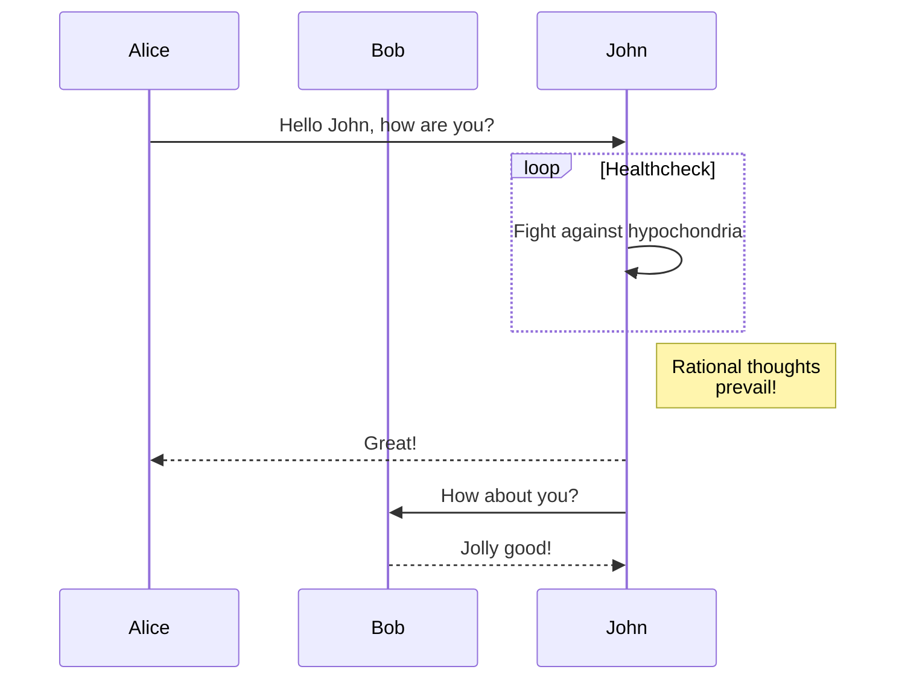

+++
author = 'Sable Ayala'
title = 'Math Typesetting'
date = 2025-02-11 18:28:46
description = "A brief guide to setup KaTeX"
math = true
ShowToc = true
draft = false

[Params]
  ShowBreadCrumbs = true
  ShowCodeCopyButtons = true
+++

Mathematical notation in a Hugo project can be enabled by using third party JavaScript libraries.

<!--more-->

In this example we will be using [KaTeX](https://katex.org/)

-   Create a partial under `/layouts/partials/math.html`
-   Within this partial reference the [Auto-render Extension](https://katex.org/docs/autorender.html) or host these scripts locally.
-   Include the partial in your templates ([`extend_head.html`](../papermod/papermod-faq/#custom-head--footer)) like so:
-   refer [ISSUE #236](https://github.com/adityatelange/hugo-PaperMod/issues/236)

```bash
{{ if or .Params.math .Site.Params.math }}
{{ partial "math.html" . }}
{{ end }}
```

-   To enable KaTex globally set the parameter `math` to `true` in a project's configuration
-   To enable KaTex on a per page basis include the parameter `math: true` in content files

**Note:** Use the online reference of [Supported TeX Functions](https://katex.org/docs/supported.html)


### Examples

> [!CAUTION]
> This may be messy to implement

Inline math: \(\varphi = \dfrac{1+\sqrt5}{2}=1.6180339887..\)

Block math:

$$
 \varphi = 1+\frac{1} {1+\frac{1} {1+\frac{1} {1+\cdots} } }
$$

